<h1 align="center">Sage Memory</h1>
<p align="center">
  
</p>
<p align="center"><strong>Persistent wisdom. Structured thought.</strong></p>

Sage Memory is a local [MCP](https://modelcontextprotocol.io) memory server for AI agents. It gives any AI assistant — coding tools, personal agents, team copilots — three kinds of persistent memory that compound over time:

**Knowledge** — what you understand. Architecture, conventions, preferences, domain logic. *(→ memory skill)*

**Structure** — how things connect. Entity relationships, dependency graphs, ownership. *(→ ontology skill)*

**Experience** — what you've learned the hard way. Mistakes, corrections, prevention rules. *(→ self-learning skill)*

One search returns all three. The agent knows how things work, how they connect, and what to watch out for — the way a human expert thinks about a domain.

```
  memory skill        ontology skill       self-learning skill
       │                    │                      │
       ▼                    ▼                      ▼
  ┌─────────┐       ┌────────────┐        ┌────────────┐
  │Knowledge│       │ Structure  │        │ Experience │
  │ (prose) │       │  (graph)   │        │  (rules)   │
  └────┬────┘       └─────┬──────┘        └─────┬──────┘
       │                  │                      │
       └──────────────────┼──────────────────────┘
                          ▼
                ┌───────────────────┐
                │    sage-memory    │
                │  one SQLite file  │
                │  FTS5 + vec + edges│
                └────────┬──────────┘
                         │
                         ▼
                   unified search
              "what do I know about X?"
          → knowledge + structure + experience
```

### Why Sage Memory

- **The agent gets better every session.** Mistakes become prevention rules. Prevention rules compound across projects. The agent develops judgment, not just a bigger database.
- **Intelligence lives in skills, not in the server.** The server is fast and dumb (~1,500 lines). Three skills teach the agent *what* to remember, *how* to learn from errors, and *when* to recall. Improve the agent by editing a markdown file, not shipping code.
- **Zero infrastructure. One SQLite file.** No Docker, no Redis, no cloud, no API keys. Your knowledge never leaves your machine.

### Highlights

- **91% recall** on natural language queries — proven on 4 real codebases (340K lines)
- **Sub-3ms search**, sub-0.3ms graph traversal, ~1,000 writes/sec
- **Self-learning loop** — mistake → prevention rule → recall → improvement, automatically
- **Graph-native** — typed edges with cycle-safe multi-hop traversal
- **2 dependencies, ~1,500 lines** — lean, auditable, no ML stack required

## Setup

With [uv](https://docs.astral.sh/uv/), sage-memory installs and runs automatically — no manual `pip install`:

> **Don't have uv?** One command: `curl -LsSf https://astral.sh/uv/install.sh | sh`
> ([full guide](https://docs.astral.sh/uv/getting-started/installation/))

### Claude Code

```json
{
  "mcpServers": {
    "sage-memory": {
      "command": "uvx",
      "args": ["sage-memory"]
    }
  }
}
```

### Cursor

In `.cursor/mcp.json`:

```json
{
  "mcpServers": {
    "sage-memory": {
      "command": "uvx",
      "args": ["sage-memory"]
    }
  }
}
```

<details>
<summary><b>Alternative: install with pip</b></summary>

```bash
pip install sage-memory
```

Use `"command": "sage-memory"` instead of `uvx` in your MCP config.

For neural embeddings: `pip install sage-memory[neural]`

</details>

## How It Works

### Two databases, automatic routing

Each context gets its own database. Cross-context knowledge lives separately. Search hits both; context results rank higher.

```
~/code/billing-service/
  .sage-memory/memory.db    ← this project's knowledge
~/.sage-memory/memory.db    ← cross-project patterns
```

Call `sage_memory_set_project` at session start to tell sage-memory which project you're working on. This ensures stores and searches hit the correct database — especially important when the MCP server stays running across project switches. Without it, sage-memory falls back to detecting the project from the server's working directory.

### Search

FTS5 BM25 with OR semantics — documents matching more query terms rank higher. AND-based alternatives require every term to match, returning nothing for natural language queries. This single decision gives sage-memory 91% recall where AND-based systems achieve 20%.

`filter_tags` applies a hard AND filter before ranking — use for namespace isolation (e.g., `filter_tags: ["self-learning"]` returns only learnings). `tags` applies a soft boost without excluding.

### Graph

Typed directed edges between memories via `sage_memory_link`. Cycle-safe multi-hop traversal via `sage_memory_graph`. One graph call replaces N sequential searches for dependency chains, blocking relationships, or ownership trees.

### Self-learning loop

<p align="center">
  
</p>

## Tools

| Tool | Purpose |
|------|---------|
| `sage_memory_set_project` | Set active project for this session — call first |
| `sage_memory_store` | Persist knowledge with SHA-256 auto-dedup |
| `sage_memory_search` | BM25 search with `filter_tags` (hard) and `tags` (soft boost) |
| `sage_memory_update` | Partial update by ID, auto re-index |
| `sage_memory_delete` | Delete by ID — CASCADE removes connected edges |
| `sage_memory_list` | Browse with AND tag filtering |
| `sage_memory_link` | Create/delete typed directed edges |
| `sage_memory_graph` | Cycle-safe multi-hop traversal |

<details>
<summary><b>Tool examples</b></summary>

**Set project context (call first):**
```json
{
  "path": "/home/user/code/billing-service"
}
```

**Store:**
```json
{
  "content": "The billing service uses saga pattern. PaymentOrchestrator coordinates StripeGateway, LedgerService, NotificationService.",
  "title": "Payment saga orchestration via PaymentOrchestrator",
  "tags": ["billing", "saga", "architecture"],
  "scope": "project"
}
```

**Search with namespace isolation:**
```json
{
  "query": "payment failure handling",
  "filter_tags": ["self-learning"],
  "limit": 5
}
```

**Link two memories:**
```json
{
  "source_id": "abc123",
  "target_id": "def456",
  "relation": "depends_on",
  "properties": {"confidence": 0.9}
}
```

**Traverse dependencies (2 hops):**
```json
{
  "id": "abc123",
  "relation": "depends_on",
  "direction": "outbound",
  "depth": 2
}
```

</details>

## Skills

Three built-in skills, one for each kind of memory. Each works with MCP (full capability) or filesystem fallback (reduced but functional).

### memory → Knowledge

Three layers: automatic recall at session start, automatic remember during work, deliberate capture via `sage learn` with dependency graph building and knowledge reports.

### ontology → Structure

Typed knowledge graph. Entities (Task, Person, Project, Event, Document) as memories. Relationships as graph edges via `sage_memory_link`. Validation rules, cardinality constraints, cycle detection.

### self-learning → Experience

Closed-loop mistake detection. Five types: gotcha, correction, convention, api-drift, error-fix. Every learning has a four-part structure: what happened, why wrong, what's correct, prevention rule. Promotion ladder: context → personal → team scope.

Learnings link to ontology entities, enabling graph-based targeted recall: "show me all past mistakes connected to this task."

## Use Cases

**Coding assistants** — learn your codebase, conventions, and past debugging insights. Build architecture graphs during code exploration. Avoid repeating the same mistakes across sessions. *This is where Sage Memory has the deepest benchmarks and proven skills.*

**Personal agents** — learn user preferences, remember relationships between people and places, avoid repeating rejected suggestions. An agent that remembers "user is vegetarian, allergic to nuts" and never suggests incompatible options again.

**Team copilots** — learnings promoted from personal to team scope mean everyone benefits from each member's corrections. Organizational knowledge accumulates without manual documentation.

## Performance

| Memories | Store | Search mean | Search P95 | Recall |
|----------|-------|-------------|------------|--------|
| 1,000    | 1.0ms | 2.5ms       | 9ms        | 80%    |
| 5,000    | 0.9ms | 12ms        | 56ms       | 81%    |
| 10,000   | 0.9ms | 21ms        | 72ms       | 83%    |
| 22,000   | 1.0ms | 46ms        | 101ms      | 83%    |

Graph: 0.19ms P50 edge creation, 0.17ms P50 traversal. 49 tests, all passing.

On LLM-authored content (the real use case): **91% overall recall** — 100% on API lookups, workflow, and architecture queries.

## Optional: Neural Embeddings

Default uses a zero-dependency local embedder. For higher semantic recall:

```bash
pip install sage-memory[neural]
```

Auto-detected, enables hybrid search (FTS5 + vector via Reciprocal Rank Fusion).

## Architecture

```
src/sage_memory/           ~1,500 lines · 2 dependencies (mcp, sqlite-vec)
├── server.py              8 MCP tools, dict dispatch
├── search.py              Dual-DB, FTS5 OR, RRF, filter_tags
├── store.py               Store, update, delete, list
├── graph.py               Link management, cycle-safe traversal
├── embedder.py            Protocol + local + optional neural
├── db.py                  Project detection, set_project, dual DB, migrations
└── migrations/            memories + FTS5 + vec0 + edges

skills/                    3 built-in skills (usable independently)
├── memory/                Knowledge persistence + capture
├── ontology/              Typed knowledge graph
└── self-learning/         Mistake detection + prevention rules

docs/
├── adr-architecture.md    Full architectural decision record
├── skill-authoring.md     Build your own skills
└── storage-protocol.md    Tag, content, scope conventions
```

## Development

```bash
git clone https://github.com/xoai/sage-memory.git
cd sage-memory
pip install -e ".[dev]"
PYTHONPATH=src python tests/test_all.py
```

## License

MIT
