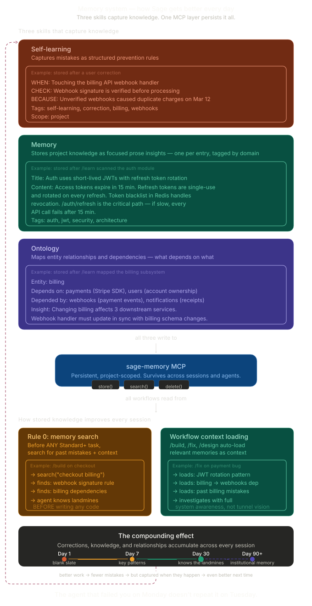

# sage-memory

<p align="center">
  
</p>

<p align="center">Persistent wisdom. Structured thought</p>

<p align="center">Memory that learns. Not just remembers.</p>

sage-memory is a local [MCP](https://modelcontextprotocol.io) memory server for AI agents. It gives any AI assistant — coding tools, personal agents, team copilots — three kinds of persistent memory that compound over time:

- **Knowledge** — what you understand. Architecture, conventions, preferences, domain logic. *(→ sage-memory skill)*

- **Structure** — how things connect. Entity relationships, dependency graphs, ownership. *(→ sage-ontology skill)*

- **Experience** — what you've learned the hard way. Mistakes, corrections, prevention rules. *(→ sage-self-learning skill)*

One search returns all three. The agent knows how things work, how they connect, and what to watch out for — the way a human expert thinks about a domain.

```
  sage-memory       sage-ontology      sage-self-learning
       │                  │                     │
       ▼                  ▼                     ▼
  ┌─────────┐       ┌────────────┐        ┌────────────┐
  │Knowledge│       │ Structure  │        │ Experience │
  │ (prose) │       │  (graph)   │        │  (rules)   │
  └────┬────┘       └─────┬──────┘        └─────┬──────┘
       │                  │                     │
       └──────────────────┼─────────────────────┘
                          ▼
                ┌───────────────────┐
                │    sage-memory    │
                │  one SQLite file  │
                │ FTS5 + vec + edges│
                └────────┬──────────┘
                         │
                         ▼
                   unified search
              "what do I know about X?"
          → knowledge + structure + experience
```

## Where sage fits

sage works for any AI agent that needs persistent memory.
**Where it shines:**

- **Local-first deployments** — proprietary data can't go to a
  hosted SaaS; everything stays on your machine.
- **Code-aware agents** — tree-sitter codebase scan across 10
  languages indexes functions/classes/imports/calls (0.11+).
- **Learning-from-mistakes loops** — the self-learning skill turns
  every correction into a prevention rule, so agents don't repeat
  the same bugs across sessions.
- **Graph-style reasoning** — typed edges + cycle-safe multi-hop
  traversal handle dependency-style queries ("what depends on X?")
  that pure vector search can't.

**Where you might prefer another tool:**

- **Hosted SaaS with no infra** — sage is local-first by design.
- **Conversation-turn auto-extraction** — [sage-wiki](https://github.com/xoai/sage-wiki) extracts facts & concepts from raw data
  via an LLM. sage requires the agent to call `sage_memory_store`
  explicitly (with optional 0.9.0 agent-driven entities/relations).
- **Cross-machine sync out of the box** — sage's per-project DBs
  live in `.sage-memory/`; sync is a user concern (Git, syncthing,
  etc.) not a built-in.

Both tools are valid; pick based on your infrastructure.

### Why sage-memory

- **The agent gets better every session.** Mistakes become prevention rules. Prevention rules compound across projects. The agent develops judgment, not just a bigger database.
- **Intelligence lives in skills, not in the server.** The server is fast and dumb. Three skills teach the agent *what* to remember, *how* to learn from errors, and *when* to recall. Improve the agent by editing a markdown file, not shipping code.
- **Zero infrastructure. One SQLite file.** No Docker, no Redis, no cloud, no API keys. Your knowledge never leaves your machine.

### Highlights

- **Coding-assistant memory** — tree-sitter codebase scan across 10 languages indexes functions, classes, imports, and calls; agents answer cross-file queries in milliseconds without re-reading source. *(0.11+, opt-in via `[codebase]` extra)*
- **Experience layer** — every correction becomes a prevention rule; rules promote from context → personal → team scope. The same mistakes don't recur across sessions.
- **Skills-as-intelligence** — improve the agent by editing markdown, not shipping code. 3 bundled skills + 5 supported agents (`sage-memory install-skills <agent>`).
- **97.2% recall@5 on LongMemEval-S, zero API cost** (pure FTS5+RRF). Add an embedder key and it goes to **98.6%** — beating gbrain (0.976) at ~$0.50 per 500q. [Full report](evaluation/longmemeval/REPORT.md) · [Reproducer](evaluation/longmemeval/REPRODUCER.md)
- **91% recall** on natural language queries — proven on 4 real codebases (340K lines)
- **Sub-3ms search**, sub-0.3ms graph traversal, ~1,000 writes/sec
- **Self-learning loop** — mistake → prevention rule → recall → improvement, automatically
- **Graph-native** — typed edges with cycle-safe multi-hop traversal
- **Six-stage retrieval pipeline** with chunking, query expansion, and rerank — all optional, all opt-in via API key
- **Lean** — 4 runtime dependencies, no ML stack required for the free path

## Setup

With [uv](https://docs.astral.sh/uv/), sage-memory installs and runs automatically — no manual `pip install`:

> **Don't have uv?** One command: `curl -LsSf https://astral.sh/uv/install.sh | sh`
> ([full guide](https://docs.astral.sh/uv/getting-started/installation/))

### Claude Code

```json
{
  "mcpServers": {
    "sage-memory": {
      "command": "uvx",
      "args": ["sage-memory"]
    }
  }
}
```

### Cursor

In `.cursor/mcp.json`:

```json
{
  "mcpServers": {
    "sage-memory": {
      "command": "uvx",
      "args": ["sage-memory"]
    }
  }
}
```

### Latest vs. pinned version

The config above pulls the **latest** sage-memory release on every MCP boot. To pin a specific version, use `uvx`'s `package==version` form in `args`:

```json
{
  "mcpServers": {
    "sage-memory": {
      "command": "uvx",
      "args": ["sage-memory==0.10.0"]
    }
  }
}
```

Other patterns:

| Goal | `args` value |
|---|---|
| Latest at install time (cached after) | `["sage-memory"]` |
| **Always pull latest** (refresh on every MCP boot) | `["--refresh", "sage-memory"]` |
| Pin exact version | `["sage-memory==0.10.0"]` |
| Pin minor (auto-update within 0.10.x) | `["sage-memory~=0.10.0"]` |
| Stay below the next minor | `["sage-memory>=0.10.0,<0.11.0"]` |
| With neural embeddings | `["sage-memory[neural]"]` (add `==0.10.0` to pin) |
| With codebase scan | `["sage-memory[codebase]"]` (add `==0.11.0` to pin) |

**Note on `--refresh`:** without it, `uvx` caches the resolved version per tool (TTL-bounded), so you may keep running an old release after PyPI ships a new one. Adding `--refresh` re-resolves against PyPI on every MCP boot — pairs well with the "latest" workflow at the cost of a small startup network call.

```json
{
  "mcpServers": {
    "sage-memory": {
      "command": "uvx",
      "args": ["--refresh", "sage-memory"]
    }
  }
}
```

The same syntax works for `pip install`:

```bash
pip install sage-memory                # latest
pip install sage-memory==0.10.0        # exact pin
pip install 'sage-memory>=0.10,<0.11'  # range pin
pip install sage-memory[neural]        # with neural embeddings
pip install sage-memory[codebase]      # with codebase scan
```

Pinning is recommended for production / CI environments where reproducibility matters. For interactive coding-agent use, the latest-by-default setup is usually fine — sage-memory ships fast (we're at minor X.Y bumps every cycle), but releases are additive and backwards-compatible at the MCP wire level.

After a version bump, refresh the bundled skills in your agent:

```bash
sage-memory install-skills <agent> --project   # or --global
```

`pip install -U` doesn't touch installed skill files — they live in your agent's config directories. Re-running `install-skills` after upgrade picks up any new instructions in the bundled skills.

<details>
<summary><b>Alternative: install with pip</b></summary>

```bash
pip install sage-memory
```

Use `"command": "sage-memory"` instead of `uvx` in your MCP config.

For neural embeddings: `pip install sage-memory[neural]`

</details>

## Optional: Codebase Scan (0.11+)

Pre-index your source tree via tree-sitter so agents can answer cross-file
queries ("where is X called?", "what imports Y?") in milliseconds without
re-reading files. **10 languages** supported:

| Language | Extensions | Symbols captured |
|---|---|---|
| Python | `.py` | FUNCTION, CLASS, METHOD |
| TypeScript | `.ts`, `.tsx` | FUNCTION, CLASS, METHOD, INTERFACE, ENUM |
| JavaScript | `.js`, `.jsx`, `.mjs`, `.cjs` | FUNCTION, CLASS, METHOD |
| Go | `.go` | FUNCTION, METHOD, STRUCT |
| Rust | `.rs` | FUNCTION, METHOD (impl), STRUCT, ENUM |
| Java | `.java` | CLASS, METHOD, INTERFACE, ENUM |
| Ruby | `.rb` | CLASS, METHOD, FUNCTION |
| PHP | `.php` | CLASS, METHOD, INTERFACE, FUNCTION |
| C | `.c`, `.h` (heuristic) | FUNCTION, STRUCT |
| C++ | `.cpp`, `.cc`, `.cxx`, `.hpp`, `.hxx`, `.h` (heuristic) | CLASS, METHOD, FUNCTION, STRUCT |

Install the extra:

```bash
pip install 'sage-memory[codebase]'
```

Run the scan:

```bash
sage-memory scan-codebase            # walks project root
sage-memory scan-codebase --dry-run  # count files without writing
sage-memory scan-codebase --languages py,ts  # subset
sage-memory scan-codebase --force    # re-parse all (default skips unchanged)
```

Or invoke the MCP tool from your agent:

```json
{
  "name": "sage_memory_scan_codebase",
  "arguments": {"path": null, "languages": ["py", "ts"]}
}
```

Then discover code via search with the `codebase` tag filter:

```json
{
  "name": "sage_memory_search",
  "arguments": {"query": "payment retry", "filter_tags": ["codebase"]}
}
```

**Safety guards:**
- Refuses to scan `$HOME` directly.
- `--limit` (default 5000) caps file count BEFORE any DB writes.
- Project-scoped advisory lock prevents concurrent scans on the same project (with 600s stale recovery).
- Atomic per-file writes — a parse failure on file N leaves files 1..N-1 cleanly indexed.
- `code_relations` capture `imports` + `calls` with `confidence: resolved | unresolved` so agents can filter for high-signal cross-file links.

**When the extra isn't installed:** the CLI prints an install hint and exits 2; the MCP tool returns `{success: false, message: ...}` so agents can fall back to their own AST extraction via the 0.9.0 `entities` / `relations` payload on `sage_memory_store`.

## How It Works

### Two databases, automatic routing

Each context gets its own database. Cross-context knowledge lives separately. Search hits both; context results rank higher.

```
~/code/billing-service/
  .sage-memory/memory.db    ← this project's knowledge
~/.sage-memory/memory.db    ← cross-project patterns
```

Call `sage_memory_set_project` at session start to tell sage-memory which project you're working on. This ensures stores and searches hit the correct database — especially important when the MCP server stays running across project switches. Without it, sage-memory falls back to detecting the project from the server's working directory.

### Search

FTS5 BM25 with OR semantics — documents matching more query terms rank higher. AND-based alternatives require every term to match, returning nothing for natural language queries. This single decision gives sage-memory 91% recall where AND-based systems achieve 20%.

`filter_tags` applies a hard AND filter before ranking — use for namespace isolation (e.g., `filter_tags: ["self-learning"]` returns only learnings). `tags` applies a soft boost without excluding.

### Graph

Typed directed edges between memories via `sage_memory_link`. Cycle-safe multi-hop traversal via `sage_memory_graph`. One graph call replaces N sequential searches for dependency chains, blocking relationships, or ownership trees.

### Self-learning loop

<p align="center">
  
</p>

## Tools

| Tool | Purpose |
|------|---------|
| `sage_memory_set_project` | Set active project for this session — call first |
| `sage_memory_store` | Persist knowledge with SHA-256 auto-dedup |
| `sage_memory_search` | BM25 search with `filter_tags` (hard) and `tags` (soft boost) |
| `sage_memory_update` | Partial update by ID, auto re-index |
| `sage_memory_delete` | Delete by ID — CASCADE removes connected edges |
| `sage_memory_list` | Browse with AND tag filtering |
| `sage_memory_link` | Create/delete typed directed edges |
| `sage_memory_graph` | Cycle-safe multi-hop traversal |
| `sage_memory_scan_codebase` | Tree-sitter index of source code (10 languages) — requires `[codebase]` extra |

<details>
<summary><b>Tool examples</b></summary>

**Set project context (call first):**
```json
{
  "path": "/home/user/code/billing-service"
}
```

**Store:**
```json
{
  "content": "The billing service uses saga pattern. PaymentOrchestrator coordinates StripeGateway, LedgerService, NotificationService.",
  "title": "Payment saga orchestration via PaymentOrchestrator",
  "tags": ["billing", "saga", "architecture"],
  "scope": "project"
}
```

**Search with namespace isolation:**
```json
{
  "query": "payment failure handling",
  "filter_tags": ["self-learning"],
  "limit": 5
}
```

**Link two memories:**
```json
{
  "source_id": "abc123",
  "target_id": "def456",
  "relation": "depends_on",
  "properties": {"confidence": 0.9}
}
```

**Traverse dependencies (2 hops):**
```json
{
  "id": "abc123",
  "relation": "depends_on",
  "direction": "outbound",
  "depth": 2
}
```

**Scan codebase (0.11+, requires `[codebase]` extra):**
```json
{
  "path": null,
  "languages": ["py", "ts"],
  "include_ignored": false,
  "limit": 5000,
  "force": false,
  "dry_run": false
}
```
Returns `{success: true, files: {scanned, changed, unchanged, with_error_nodes}, symbols: {...}, relations: {imports, calls_resolved, calls_unresolved}, elapsed_ms, ...}`. When the extra isn't installed: `{success: false, message: "scan-codebase requires the [codebase] extra..."}`.

**Discover code via search after a scan:**
```json
{
  "query": "payment retry logic",
  "filter_tags": ["codebase"],
  "limit": 5
}
```
Each scanned file becomes a memory tagged `codebase`/`file`/`<lang>`, so `filter_tags: ["codebase"]` surfaces files only; combine with the query to pinpoint the relevant source.

</details>

## Skills

Three built-in skills, one for each kind of memory. Each works with MCP (full capability) or filesystem fallback (reduced but functional).

Skill identifiers are prefixed `sage-` since 0.10.0 to avoid collision with agents' native skill catalogs: `sage-memory`, `sage-ontology`, `sage-self-learning`.

### sage-memory → Knowledge

Three layers: automatic recall at session start, automatic remember during work, deliberate capture via `sage learn` with dependency graph building and knowledge reports.

### sage-ontology → Structure

Typed knowledge graph. Entities (Task, Person, Project, Event, Document) as memories. Relationships as graph edges via `sage_memory_link`. Validation rules, cardinality constraints, cycle detection.

### sage-self-learning → Experience

Closed-loop mistake detection. Five types: gotcha, correction, convention, api-drift, error-fix. Every learning has a four-part structure: what happened, why wrong, what's correct, prevention rule. Promotion ladder: context → personal → team scope.

Learnings link to ontology entities, enabling graph-based targeted recall: "show me all past mistakes connected to this task."

### Installing skills into your agent

The three skills ship inside the wheel. Install them into your AI agent of choice:

```bash
# Claude Code (this project only)
sage-memory install-skills claude-code --project

# Cursor (user-wide, all projects)
sage-memory install-skills cursor --global

# Every supported agent at once
sage-memory install-skills all --project
```

**Supported agents:** Claude Code, Cursor, Codex CLI, Gemini CLI, OpenCode. Each gets its native skill format — directory of `SKILL.md` files for Claude Code, `.mdc` rules for Cursor, marker-delimited blocks in `AGENTS.md` / `GEMINI.md` for the others. Re-installs are idempotent; modified files trigger a diff prompt. Use `--dry-run` to preview, `-y` to auto-overwrite (required in non-TTY environments like CI).

### Agent-driven extraction (0.9+)

The agent already has an LLM behind it — sage-memory doesn't need to call a *second* one in the background to extract entities. When the agent calls `sage_memory_store`, it can pass `entities=[{name, type}, ...]` and `relations=[{from, to, rel}, ...]` so the knowledge graph is populated synchronously, no LLM API key required for sage-memory itself. Re-run `sage-memory install-skills` after upgrading from 0.8.x to refresh the bundled skills with the new extraction pattern.

## Use Cases

**Coding assistants** — learn your codebase, conventions, and past debugging insights. Build architecture graphs during code exploration. Avoid repeating the same mistakes across sessions. *This is where sage-memory has the deepest benchmarks and proven skills.*

**Personal agents** — learn user preferences, remember relationships between people and places, avoid repeating rejected suggestions. An agent that remembers "user is vegetarian, allergic to nuts" and never suggests incompatible options again.

**Team copilots** — learnings promoted from personal to team scope mean everyone benefits from each member's corrections. Organizational knowledge accumulates without manual documentation.

## Performance

| Memories | Store | Search mean | Search P95 | Recall |
|----------|-------|-------------|------------|--------|
| 1,000    | 1.0ms | 2.5ms       | 9ms        | 80%    |
| 5,000    | 0.9ms | 12ms        | 56ms       | 81%    |
| 10,000   | 0.9ms | 21ms        | 72ms       | 83%    |
| 22,000   | 1.0ms | 46ms        | 101ms      | 83%    |

Graph: 0.19ms P50 edge creation, 0.17ms P50 traversal. 49 tests, all passing.

On LLM-authored content (the real use case): **91% overall recall** — 100% on API lookups, workflow, and architecture queries.

## LongMemEval-S — Benchmark

| Config | R@1 | R@3 | **R@5** | R@10 | API cost |
|---|---|---|---|---|---|
| **Free-path** (FTS5 + RRF, LocalEmbedder 384d) | 0.834 | 0.952 | **0.972** | 0.986 | **$0** |
| **Hosted-vector** (FTS5 + RRF + OpenAI 1536d) | 0.886 | 0.970 | **0.986** | 0.992 | ~$0.50 per 500q |
| Hosted-vector Δ over free-path | +5.2pp | +1.8pp | **+1.4pp** | +0.6pp | |

- **Free-path 97.2% R@5** is the headline number for users with no embedder API key. Pure FTS5 BM25 + chunk-level RRF fusion, 384d local embeddings used only for the vector channel (which contributes little to R@5 on this dataset). No LLM calls in the retrieval path.
- **Hosted-vector 98.6% R@5** demonstrates the ADR-005 cascade is doing real work when a hosted embedder is configured. The +1.4pp lift comes mostly from semantic question types (single-session-preference, temporal-reasoning).

## Optional: Neural Embeddings

Default uses a zero-dependency local embedder. For higher semantic recall:

```bash
pip install sage-memory[neural]
```

Auto-detected, enables hybrid search (FTS5 + vector via Reciprocal Rank Fusion).

One-command upgrade (validates the tier, then backs up + migrates the
vector tables and re-embeds):

```bash
sage-memory embedder use fastembed   # local neural, 384d
sage-memory embedder use openai      # hosted 1536d (needs OPENAI_API_KEY)
sage-memory embedder use local       # back to the zero-dep floor
```

`sage-memory status` shows the active embedder and stale-embedding
count, with the next step when rows are stale.

## Retrieval Pipeline

Sage Memory's search is a **six-stage pipeline** combining three
retrieval **channels** under a single weighted Reciprocal Rank Fusion
(RRF) score. The design and acceptance criteria are spelled out in
the architecture decision records.

**The three channels:**
- **`bm25`** — FTS5 full-text search over titles + content + tags.
  Always-on; the load-bearing channel for keyword recall.
- **`vector`** — sqlite-vec cosine similarity. Skipped when no
  hosted embedder is configured AND the local 384d embedder's
  quality falls below the vector-search threshold.
- **`graph`** — entity-mediated proximity. Two-layer BFS over auto-
  extracted entity mentions + manual edges; contributes when an
  LLM key is configured and the worker has populated the entity
  graph. The default channel weight is 0.7.

### What runs by default

A fresh install with no extras and no API keys runs **BM25 only** —
and that's fine: it's the 97.2% R@5 free path. Each upgrade unlocks
exactly one channel:

| Configuration | Channels actually active | Cost |
|---|---|---|
| Default (no extras, no key) | BM25 (FTS5) | $0 |
| `+ [neural]` extra | BM25 + vector | $0, local model download |
| `+ hosted embedder key` | BM25 + vector (higher quality) | ~$0.50 / 500 q |
| `+ agent-supplied entities` or LLM worker | BM25 + vector + graph | LLM cost if worker used |

Two honest footnotes. The local TF-IDF embedder (quality 0.45) sits
below the vector-channel quality gate, so `vector` stays off until
`[neural]` or a hosted key raises embedder quality. And the **graph
channel is empty until entities exist** — entities come from the
optional LLM worker or from explicit `entities`/`relations` you pass
to `sage_memory_store`; a code scan does not create them. This is by
design: with an empty entity table the graph channel takes an
empty-table fast path and the three-channel RRF degrades
byte-for-byte to the two-channel result.

**The six stages** (per call, in order):
1. **expand** — optional LLM query expansion produces `{lex, vec,
   hyde}` variants. A strong-signal short-circuit on the FTS5 bm25
   score skips the LLM call when the top
   hit is confident.
2. **retrieve** — per-channel candidate fetch. Lex variants extend
   the bm25 channel; vec/hyde extend the vector channel.
3. **fuse** — weighted RRF across the three channels collapses to
   a single ranked list.
4. **dedup** — chunk-to-memory rollup. Chunks live in the schema
   shipped;
   chunk hits are folded back into their parent memory.
5. **rerank** — optional LLM rerank on the top-K candidates with a
   position-blend curve `[0.75, 0.6, 0.4]` over positions
   `[1-3, 4-10, 11+]`.
6. **score** — tag boost, recency tiebreaker, project-vs-global
   priority. Final ordering returned to the caller.

**Background machinery:**
- The **extraction worker** processes writes asynchronously, populating entities, mentions, and
  relations for the graph channel. It also handles `reembed` tasks
  (used by `sage-memory reindex`) and `dedup` tasks (LLM-confirmed
  entity merging).
- The **embedder cascade** resolves a corpus-locked embedder tier at startup. Switching
  tiers requires `sage-memory reindex --re-embed --embedder <name>`
  to atomically swap `memories_vec` + `chunks_vec` and queue
  reembed tasks.

**Free-path floor:** every LLM-gated feature (expand, rerank, entity
extraction, dedup) degrades silently when no LLM key is configured.
Search continues to work; the graph channel returns empty and falls
out of the RRF; expand/rerank are no-ops. This preserves the
zero-config promise — install, store, search.

## Architecture

```
src/sage_memory/           ~8,600 lines · 4 deps (mcp, sqlite-vec, httpx, pyyaml)

  Server
  ├── server.py            MCP server: 8 tools, dict dispatch
  └── __main__.py          CLI entry

  Storage + DB
  ├── db.py                Project detection, dual DB, migration runner
  ├── store.py             Memory CRUD (store, update, delete, list)
  ├── graph.py             Edge management, cycle-safe traversal
  ├── extraction_write.py  Shared entity/mention/relation write helper —
                           used by worker AND agent-driven store path
                           (0.9+: agents pass `entities`/`relations` inline)
  └── migrations/          8 SQL migrations: memories + FTS5 + vec0,
                           edges, health, chunks, entities,
                           embedding metadata, extraction queue,
                           worker state

  Retrieval pipeline (six stages: expand → retrieve → fuse →
  dedup → rerank → score)
  ├── search.py            Dual-DB orchestration, BM25 + RRF, scoring
  ├── expand.py            LLM query expansion (opt-in via expand=true)
  ├── rerank.py            LLM rerank with position blend (opt-in)
  ├── graph_channel.py     Entity-mediated BFS — third RRF channel
  ├── chunker.py           Paragraph/sentence-aware splitter
  └── suggested_links.py   FTS5 link-candidate lookup; returns up to
                           3 existing memories that overlap with a
                           new store/update (~4ms p95 on 1K corpus)

  Embedder cascade
  └── embedder.py          Local + FastEmbed + OpenAI + Voyage + Cohere

  Background worker + LLM
  ├── worker.py            Polling loop, at-most-one task contract.
                           Deprecated in 0.10; removal in 1.0 once
                           agent-driven extraction is the norm
  ├── extractor.py         LLM entity/relation extraction + agent-payload
                           validation (validate_agent_payload)
  ├── llm.py               Provider cascade with retry
  ├── dedup.py             LLM-confirmed memory deduplication
  └── config.py            3-layer config cascade (call > env > yaml > built-in)

  CLI (sage-memory <subcommand>)
  ├── cli_status.py        status
  ├── cli_worker.py        worker --status
  ├── cli_reindex.py       reindex (--re-embed, --embeddings, ...)
  ├── cli_dedup.py         dedup (async / --sync)
  ├── cli_queue.py         queue prune
  └── cli_install_skills.py
                           install-skills <agent>... [--project | --global]

  install-skills package (5 agent adapters)
  ├── install_skills/markers.py            Marker-block helpers + 0.10
                                            legacy-name migration
  ├── install_skills/paths.py              Per-agent target resolution (XDG)
  ├── install_skills/prompt.py             Diff prompt + Decision enum
  ├── install_skills/agents_markdown.py    Shared block renderer
  ├── install_skills/_markdown_adapter_base.py
                                            Codex/Gemini/OpenCode base
  └── install_skills/agent_{claude_code,
       cursor, codex, gemini, opencode}.py
                                            One adapter per supported agent

  Bundled skills (ship inside the wheel, since 0.8.0)
  src/sage_memory/skills/
  ├── sage-memory/         Knowledge persistence + capture
  ├── sage-ontology/       Typed knowledge graph
  └── sage-self-learning/  Mistake detection + prevention rules
                           (renamed from bare names in 0.10.0)
```

## Development

```bash
git clone https://github.com/xoai/sage-memory.git
cd sage-memory
pip install -e ".[dev]"
PYTHONPATH=src python tests/test_all.py
```

## License

MIT
