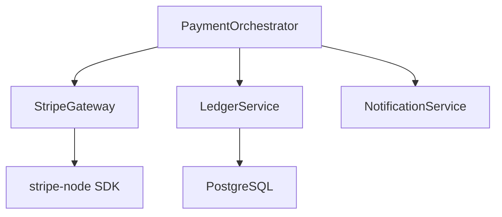
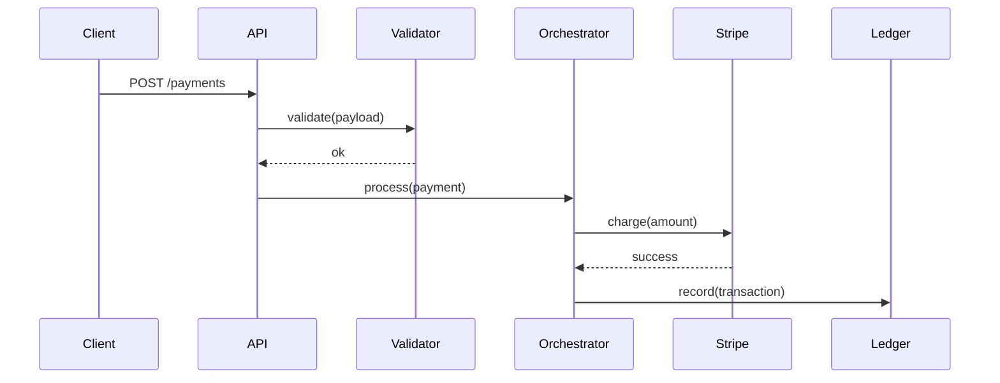

# Knowledge Reports

Guide for producing knowledge reports during `sage learn`. A knowledge
report is the human-readable companion to memory entries — comprehensive,
structured, and reviewable.

## Principles

**Flexible structure, not rigid template.** Adapt sections to what was
found. A billing module report has different sections than a design system
report. Include what's informative, skip what's not.

**Insights over inventory.** Don't list every file and function. Explain
what matters: how the pieces fit together, what patterns are in play, what
risks exist, what's non-obvious.

**Diagrams when they clarify.** A dependency tree for 12 interconnected
services is worth a mermaid diagram. A simple CRUD module is not. The test:
would a diagram help someone understand this faster than prose alone?

**Reference, not replace.** The report helps humans understand the system.
It doesn't replace reading the code. Link to important files, don't
reproduce them.

## Report Structure

Adapt this structure based on what you're analyzing. Not every section
applies to every report. Add sections when they serve understanding.
Remove sections when they'd be empty or obvious.

### Overview

What this is, its role in the larger system, key characteristics.
2-3 paragraphs maximum. Someone should understand the purpose and scope
after reading just this section.

### Architecture & Patterns

How it's structured. Key design patterns. Data flow. Component
relationships. This is the "how it hangs together" section.

For code: architecture style, key abstractions, data flow between layers.
For UX: design system structure, component hierarchy, state management.
For business process: stakeholders, decision points, handoffs.

### Key Components

The 5-10 most important pieces. What each does, why it matters, how it
connects to others. Don't list everything — highlight what someone needs
to know to work in this area effectively.

### Diagrams

Use mermaid when diagrams add value. Common diagram types:

**Dependency tree** — for modules with complex imports:


**Sequence diagram** — for multi-step flows:


**Flowchart** — for decision logic or state machines.

Skip diagrams for simple modules. Include them when the visual reveals
structure that prose can't convey efficiently.

### Insights

What's notable about this area. Not what the code does — what's
interesting, risky, clever, or problematic about it.

Categories to consider:
- **Risks** — single points of failure, missing error handling, race
  conditions, security gaps
- **Technical debt** — workarounds, TODO comments, duplicated logic,
  outdated patterns
- **Strengths** — well-designed abstractions, good test coverage,
  clean separation of concerns
- **Non-obvious behavior** — implicit dependencies, timing-sensitive
  logic, environment-specific behavior, edge cases

### Recommendations

Suggested improvements, areas worth deeper investigation, open questions
that emerged during analysis. Prioritize by impact — what would make the
biggest difference to someone working in this area?

### Metadata

```
Analyzed: YYYY-MM-DD
Scope: path/to/analyzed/area (N files, ~N lines)
Memories stored: N
Duration: ~N minutes
```

## Naming Convention

Reports are saved to `.sage/docs/memory-{name}.md` where `{name}` is
a kebab-case identifier:

- Broad scan: `memory-{project-name}.md`
- Deep dive: `memory-{module-or-feature-name}.md`

Examples:
- `.sage/docs/memory-billing-service.md`
- `.sage/docs/memory-auth-system.md`
- `.sage/docs/memory-design-tokens.md`

## Connection to Memory Entries

The report is comprehensive. Memory entries are distilled. They reference
each other:

- Report metadata notes how many memories were stored
- Memory entries can optionally reference the report:
  "See detailed analysis: .sage/docs/memory-billing-service.md"

In future sessions, the agent searches memory and gets quick context. If
it needs the full picture, it reads the report. Two levels of detail,
connected.

## Example: Broad Scan Report

```markdown
# my-saas — Knowledge Report

## Overview

A B2B SaaS platform for invoice management built with Next.js 14 (App
Router), Prisma ORM, PostgreSQL, and Stripe for payments. Monorepo with
pnpm workspaces: `apps/web` (frontend), `packages/api` (backend),
`packages/shared` (types and utilities).

## Architecture & Patterns

Server Components by default. Client components only for interactive
elements (forms, modals, real-time updates). Data fetching happens in
Server Components via Prisma directly — no API layer for internal reads.

Writes go through Server Actions in `apps/web/src/actions/`. Each action
validates with Zod, calls the service layer in `packages/api/src/services/`,
and revalidates affected paths.

Authentication via Auth.js (v5) with JWT strategy. Middleware in
`apps/web/middleware.ts` protects routes. Role-based access: owner,
admin, member, viewer.

## Key Components

- **PaymentOrchestrator** (`packages/api/src/services/payments/`) —
  saga pattern coordinating Stripe, ledger, and notifications
- **InvoiceEngine** (`packages/api/src/services/invoices/`) —
  generation, PDF rendering, email delivery pipeline
- **RBACMiddleware** (`apps/web/middleware.ts`) — route protection
  with role hierarchy: owner > admin > member > viewer

## Insights

- Payment processing lacks idempotency keys — retries could create
  duplicate charges
- Invoice PDF generation is synchronous and blocks the request —
  should be queued for invoices with >50 line items
- Good test coverage in packages/api (87%) but apps/web has almost
  none (12%)

## Recommendations

1. Add idempotency keys to PaymentOrchestrator before scaling
2. Move PDF generation to a background queue (Bull or similar)
3. Investigate the 8-hour UTC/PST offset in billing cycle close

---
Analyzed: 2026-03-16
Scope: full project (142 files, ~18,400 lines)
Memories stored: 14
```
